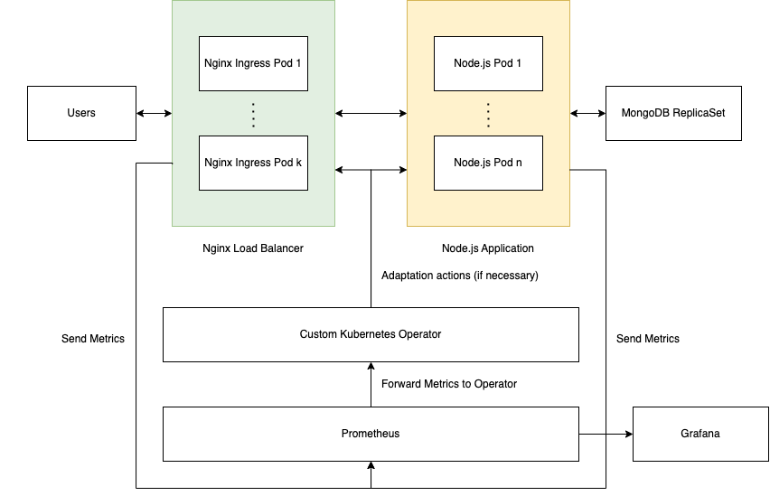

# Self-Adaptation with Kubernetes Operators

Self-adaptive microservices are essential to high availability and automation. Kubernetes has proven to be the most-used container orchestration tool, but the default Kubernetes Horizontal Pod Autoscaler (HPA) has a default immutable formula and limited support of metrics to perform self-adaptation.

HPA only has one adaptation strategy that cannot be modified,

```
desiredReplicas = ceil[currentReplicas * ( currentMetricValue / desiredMetricValue )]
```

This repository complements the paper that can be found at `/paper` folder.

The full installation steps can be found at [Installation Steps](#installation)

## Table of Contents

- [Self-Adaptation with Kubernetes Operators](#self-adaptation-with-kubernetes-operators)
  - [Table of Contents](#table-of-contents)
  - [Motivating Case Study](#motivating-case-study)
  - [Tech Architecture](#tech-architecture)
  - [Tech Stack](#tech-stack)
  - [Folder Breakdown](#folder-breakdown)
  - [Architecture Diagram](#architecture-diagram)
  - [Installation Steps](#installation-steps)
    - [Prerequisites](#prerequisites)
    - [Steps](#steps)
  - [Results](#results)

## Motivating Case Study

Inspired by a real world problem, we will be building the system that reveals a typical university's Results Day, where huge amount of traffic will spike up in a small interval. Our web application and database should be able to scale horizontally and adapt to such situations.

Experimental Setup:

- 2000 users
- Spawn rate of 2000 users per second
- Spike test duration: 120 seconds

## Tech Architecture

| Tech Component             | Description                                                        |
| -------------------------- | ------------------------------------------------------------------ |
| Nginx Load Balancer        | L4 load balancer to distribute traffic to pods                     |
| Node.js Application        | Web application with REST APIs                                     |
| MongoDB ReplicaSet         | NoSQL database to read and write data                              |
| Prometheus                 | Metrics collection tool by periodically scraping certain endpoints |
| Grafana                    | Data visualisation based on Prometheus data                        |
| Kubernetes Custom Operator | Custom solution to handle self-adaptation tasks                    |

## Tech Stack

| Technology  | Description                                                                                  |
| ----------- | -------------------------------------------------------------------------------------------- |
| Node.js     | JavaScript runtime built on Chrome's V8 JavaScript engine to power backend web applications. |
| Express.js  | JavaScript backend library                                                                   |
| TailwindCSS | CSS Framework to build websites                                                              |
| Golang      | Programming language used to write Kubernetes Operator                                       |

## Folder Breakdown

| Folder       | Description                                                                                       |
| ------------ | ------------------------------------------------------------------------------------------------- |
| bash_scripts | Bash scripts to automate the process to initialise the components in the Kubernetes Cluster       |
| controller   | Kubernetes Operator based in Golang                                                               |
| hpa          | Kubernetes Horizontal Pod Autoscaler used for benchmarking                                        |
| k6           | Load testing tool to compute results                                                              |
| locust       | Load testing tool that offers realtime visualisation of http response time                        |
| mongodb      | YAML configuration for MongoDB ReplicaSet by Bitnami                                              |
| nodejsapp    | Main application code for the described prototype                                                 |
| paper        | Research paper to benchmark performance between Horizontal Pod Autoscaler and Kubernetes Operator |
| repo         | Repo-related images for Readme                                                                    |
| results      | CSV raw results for all iterations                                                                |

## Architecture Diagram



## Installation Steps

### Prerequisites

Please ensure that you have downloaded the following before proceeding:

- [Minikube](https://minikube.sigs.k8s.io/docs/start/)
- [Node.js](https://nodejs.org/en/)
- [Golang](https://go.dev/)
- [Docker](https://www.docker.com/)
- [Helm](https://helm.sh/docs/intro/quickstart/)
- [Python3](https://www.python.org/downloads/)

### Steps

1. Clone repository & install dependencies

```bash
cd nodejsapp && npm install
cd controller && go mod install
```

2. Start minikube with 6 CPUs and 8192 RAM (Feel free to adjust as according to your device)

```bash
minikube start --cpus 6 --memory 8192 --vm-driver hyperkit --docker-opt="default-ulimit=nofile=102400:102400"
```

3. Enable addon for metrics server

```bash
minikube addons enable metrics-server
```

4. Create namespaces in Kubernetes Cluster

```bash
kubectl create namespace app
kubectl create namespace prometheus
```

5. Install [Prometheus & Grafana](https://github.com/prometheus-community/helm-charts/tree/main/charts/kube-prometheus-stack) with helm chart

```bash
helm install prometheus prometheus-community/kube-prometheus-stack -n prometheus --set prometheus.prometheusSpec.podMonitorSelectorNilUsesHelmValues=false --set prometheus.prometheusSpec.serviceMonitorSelectorNilUsesHelmValues=false
```

6. Install [Nginx Ingress Controller](https://kubernetes.github.io/ingress-nginx/) with helm chart

```bash
helm upgrade --install ingress-nginx ingress-nginx --repo https://kubernetes.github.io/ingress-nginx --namespace ingress-nginx --set controller.metrics.enabled=true --set controller.metrics.serviceMonitor.enabled=true --set controller.metrics.serviceMonitor.additionalLabels.release="prometheus"
```

7. Create MongoDB ReplicaSet using bash script

```bash
cd bash_scripts

./restart_mongodb.sh
```

Please ensure that it is fully running by checking it

```bash
kubectl get pods -n app
```

8. Create Node.js Application using bash script

```bash
cd bash_scripts

./dockerize_nodejs.sh
```

9. Get the minikube IP address. Then, add the host ip address and name to /etc/hosts. Test.com is our website for testing the prototype.

```bash
minikube ip # 192.168.6.23
```

```bash
vi /etc/hosts

# Add the following line
192.168.6.23 test.com
```

10. Add the minikube IP Address to the service

```bash
kubectl edit service main-nginx-ingress -n prometheus

# Add the following lines under spec
externalIPs:
- 192.168.6.23
```

11. Create Nginx Ingress Rule

```bash
cd nginx && kubectl apply -f .
```

12. Test the link by visiting test.com

```bash
curl test.com
```

13. If everything works fine, we can seed the database

```bash
./seed_database
```

14. Run Prometheus on localhost

```bash
kubectl port-forward -n prometheus prometheus-prometheus-kube-prometheus-prometheus-0 9090
```

15. Run Grafana on localhost

```bash
kubectl port-forward service/prometheus-grafana -n prometheus 3000:80
```

16. Run Kubernetes Operator

```bash
cd controller
make install run
```

17. Run the k6 testing tool using

```bash
cd k6
k6 run script.js
```

18. Run the locust tool with distributed load testing.

Run the following command to initialize one master.

```bash
cd locust
python3 -m locust --config master.conf
```

Run the following command on separate terminals to initialize three master.

```bash
cd locust
python3 -m locust --config worker.conf
```

19. (Optional) Create the HPA for testing

```bash
cd hpa
kubectl apply -f .
```

## Results

The following table describes the average results obtained from 10 iterations. Full details can be found at the `/results` folder.

| Variation/Http Request Duration In Seconds | Average | Minimum | Median | Maximum | p(90) | p(95) | Total Requests | Requests Per Second |
| ------------------------------------------ | ------- | ------- | ------ | ------- | ----- | ----- | -------------- | ------------------- |
| Control                                    | 6.81    | 0.33    | 6.57   | 29.59   | 9.82  | 12.40 | 31118.50       | 257.90              |
| HPA                                        | 7.43    | 0.61    | 7.25   | 27.63   | 10.09 | 14.79 | 29247.80       | 246.21              |
| Kubernetes Operator                        | 6.30    | 0.47    | 6.25   | 20.31   | 8.47  | 11.60 | 36569.60       | 301.06              |
